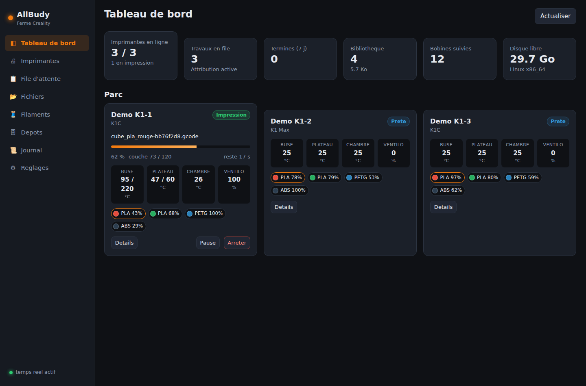

# AllBudy

**Gestion de ferme d'impression 3D pour imprimantes Creality — 100 % locale.**

AllBudy pilote plusieurs imprimantes Creality depuis une seule interface : envoi des
fichiers tranchés, file d'attente qui choisit elle-même la machine ayant la bonne
couleur et la bonne matière, suivi temps réel des températures et des couches, et
gestion des bobines du CFS. Tout se passe sur votre réseau local : **aucune requête
ne sort vers un service en ligne**, et aucun compte cloud n'est nécessaire.



---

## Sommaire

- [Fonctionnalités](#fonctionnalités)
- [Matériel compatible](#matériel-compatible)
- [Installation](#installation)
- [Préparer les imprimantes](#préparer-les-imprimantes)
- [Prise en main](#prise-en-main)
- [Comment la file d'attente choisit une machine](#comment-la-file-dattente-choisit-une-machine)
- [Configuration](#configuration)
- [API](#api)
- [Développement](#développement)
- [Limites connues](#limites-connues)

---

## Fonctionnalités

### Envoi et gestion des fichiers

- **Bibliothèque centralisée** de G-code et 3MF, stockés sur le serveur, dédoublonnés
  par empreinte SHA-256.
- **Lecture des métadonnées de tranchage** : durée estimée, matières, couleurs,
  nombre de couches, hauteur de couche, diamètre de buse, filament consommé.
  Reconnaît Creality Print, Orca Slicer, PrusaSlicer et Cura.
- **Miniatures** extraites du fichier (blocs `thumbnail`, `;gimage:` de Creality
  Print, ou l'image de plateau d'un 3MF).
- **Dépôts distants FTP / FTPS / SFTP** : importez depuis un NAS, ou renvoyez-y la
  bibliothèque pour sauvegarde. Import automatique périodique possible.
- Un 3MF non tranché est **détecté et refusé** en file d'attente : il n'est pas
  imprimable tel quel.

### File d'attente

- Attribution automatique aux machines **libres et compatibles**.
- Contraintes par travail : matière, couleur (avec tolérance de teinte réglable),
  diamètre de buse, étiquettes, liste d'imprimantes autorisées.
- Ordre manuel par glisser-déposer, priorités, exemplaires multiples.
- **Diagnostic « pourquoi ce travail attend »** : le verdict de chaque machine,
  avec la raison exacte (occupée, buse 0.4 au lieu de 0.6, aucune bobine PETG bleue…).
- Reprise automatique après échec (3 tentatives), suspension globale du dispatcher.

### Contrôle et supervision

- **Multi-machines** : tout le parc sur une page, mis à jour en temps réel par WebSocket.
- Températures (buse, plateau, chambre) avec consignes, progression, couche courante,
  temps restant, ventilateurs, éclairage, facteur de vitesse.
- Pilotage complet : pause / reprise / arrêt, déplacements, extrusion, prise d'origine,
  console G-code, arrêt d'urgence.
- **Support du CFS** (Creality Filament System) : les emplacements sont lus sur la
  machine et synchronisés dans l'inventaire. Les imprimantes sans CFS se déclarent
  à la main pour rester utilisables par la file d'attente.
- Flux caméra MJPEG affiché directement par le navigateur.
- Journal d'événements horodaté.

### Infrastructure

- **Mode LAN / hors-ligne intégral.** Deux protocoles locaux, aucun cloud.
- **Découverte réseau** : balaye le sous-réseau et identifie les machines par leur
  propre protocole.
- **Déploiement Docker** léger (image `python:3.11-slim`), adapté à un mini PC ou un
  Raspberry Pi. Base SQLite, aucune dépendance externe.

---

## Matériel compatible

AllBudy parle deux protocoles ; choisissez celui que votre machine expose.

| Protocole | Port | Machines | Couverture |
|---|---|---|---|
| **Moonraker / Klipper** *(recommandé)* | 7125 | K1, K1C, K1 Max, K2 Plus, Ender-3 V3 KE / Plus, Sonic Pad, toute machine Klipper | Complète : états poussés en temps réel, chambre, ventilateurs auxiliaires, CFS, envoi de fichiers |
| **LAN Creality** | 9999 | K1 / K2 en firmware d'origine, mode LAN activé | Bonne : états, températures, progression, pause/reprise/arrêt, envoi de fichiers, CFS |
| **Simulateur** | — | — | Pour la démo et les tests, sans matériel |

Préférez Moonraker dès qu'il est accessible : il est plus complet et plus stable. Le
protocole LAN n'est pas documenté publiquement — il a été reconstruit par observation,
et les noms de champs varient selon les versions de firmware. AllBudy lit ces champs
par alias et retombe sur des valeurs neutres quand ils manquent, mais un firmware
inhabituel peut n'exposer qu'une partie des informations.

---

## Installation

### Docker (recommandé)

```bash
git clone https://github.com/Maringouin10/allbudy.git
cd allbudy
docker compose up -d
```

L'interface est sur `http://<adresse-du-serveur>:8080` — identifiants par défaut
`admin` / `allbudy`, **à changer dès la première connexion** (Réglages → Compte).

> **Découverte réseau et Docker.** En mode `bridge` (le défaut), le conteneur ne voit
> que le réseau Docker : le balayage automatique ne trouvera rien. Sur Linux et
> Raspberry Pi, décommentez `network_mode: host` dans `docker-compose.yml` (et
> commentez le bloc `ports`). Sinon, ajoutez vos imprimantes à la main par leur IP :
> tout le reste fonctionne normalement.

Les données (base, fichiers, miniatures, clé secrète) vivent dans le volume
`allbudy-data`, monté sur `/data`.

### Sans Docker

```bash
git clone https://github.com/Maringouin10/allbudy.git
cd allbudy
python3 -m venv .venv && .venv/bin/pip install -r requirements.txt
.venv/bin/python -m allbudy.main
```

Python 3.11 ou plus récent. Copiez `.env.example` en `.env` pour ajuster la
configuration.

### Essayer sans imprimante

```bash
ALLBUDY_DEMO_PRINTERS=3 .venv/bin/python -m allbudy.main
```

Trois imprimantes simulées apparaissent, avec un CFS garni : de quoi parcourir toute
l'application, y compris des impressions qui progressent réellement.

---

## Préparer les imprimantes

Les machines Creality doivent être sorties du mode cloud pour accepter les connexions
locales.

- **K1 / K1C / K1 Max / K2 Plus** — dans les réglages de l'imprimante, activez le
  **mode LAN**. Pour disposer de Moonraker sur le port 7125, activez également le
  **mode développeur** (« root »/« développeur » selon la version du firmware).
- **Ender-3 V3 KE / Plus** — Moonraker est exposé sur le port 7125 dès que
  l'imprimante est sur le réseau ; rien de particulier à activer.
- **Firmware d'origine sans Moonraker** — utilisez le protocole *LAN Creality*
  (port 9999) au moment d'ajouter la machine.

Vérification rapide depuis le serveur :

```bash
curl http://<ip-imprimante>:7125/printer/info      # Moonraker répond du JSON
```

Ensuite, dans AllBudy : **Imprimantes → Rechercher sur le réseau**, ou **+ Ajouter**
pour saisir l'adresse à la main.

---

## Prise en main

1. **Ajoutez vos imprimantes** (découverte réseau ou saisie manuelle).
2. **Vérifiez les filaments** (écran *Filaments*). Les emplacements CFS remontent
   tout seuls. Pour une machine sans CFS, déclarez la bobine montée : matière,
   couleur, et cochez « chargée jusqu'à la buse ». Sans cette information, la file
   d'attente ne saura pas quoi lui envoyer.
3. **Déposez vos fichiers tranchés** dans l'écran *Fichiers* (glisser-déposer).
4. **Mettez en file** avec le bouton *File* : la matière et la couleur du fichier
   sont pré-remplies, ajustez si besoin.
5. Le dispatcher envoie le travail dès qu'une machine compatible se libère. Si rien
   ne part, le bouton **?** en face du travail dit précisément pourquoi.

Le bouton *Imprimer* envoie au contraire un fichier **immédiatement** sur une machine
choisie, sans passer par la file.

---

## Comment la file d'attente choisit une machine

Pour chaque travail en attente, chaque imprimante est évaluée dans cet ordre. Le
premier critère qui échoue donne la raison affichée dans le diagnostic :

1. Imprimante activée, et acceptant les travaux automatiques.
2. Connectée, et actuellement libre.
3. Présente dans la liste des imprimantes autorisées, si le travail en impose une.
4. Porte toutes les étiquettes exigées (ex. `chambre-chauffee`).
5. Diamètre de buse identique à celui exigé — sinon celui lu dans le fichier.
6. Dispose des filaments nécessaires : pour chaque matière/couleur du travail, une
   bobine **non vide** et **distincte** doit correspondre.

La couleur est comparée par distance perceptuelle : `#FF0000` et `#FA0505` sont
considérés identiques, `#FF0000` et `#0000FF` non. La **tolérance** est réglable par
travail (0 = teinte exacte, 160 = très permissif). Une couleur illisible côté bobine
ne bloque pas : le critère est simplement ignoré.

À égalité, la machine dont le filament voulu est **déjà chargé jusqu'à la buse**
l'emporte : elle évitera un changement.

Un fichier sans métadonnée de filament ne pose aucune contrainte : il part sur
n'importe quelle machine libre.

---

## Configuration

Tout passe par des variables d'environnement préfixées `ALLBUDY_` (ou un fichier
`.env`). Voir `.env.example` pour la liste complète.

| Variable | Défaut | Rôle |
|---|---|---|
| `ALLBUDY_PORT` | `8080` | Port d'écoute |
| `ALLBUDY_DATA_DIR` | `./data` | Base, fichiers, miniatures, clé secrète |
| `ALLBUDY_AUTH_ENABLED` | `true` | Mettre à `false` sur un réseau déjà cloisonné |
| `ALLBUDY_ADMIN_PASSWORD` | `allbudy` | Mot de passe initial (premier démarrage seulement) |
| `ALLBUDY_POLL_INTERVAL` | `2.0` | Rythme d'interrogation des machines (s) |
| `ALLBUDY_SCHEDULER_INTERVAL` | `5.0` | Rythme du dispatcher (s) |
| `ALLBUDY_MAX_UPLOAD_MB` | `512` | Taille maximale d'un fichier |
| `ALLBUDY_BASE_PATH` | *(vide)* | Préfixe derrière un reverse proxy, ex. `/allbudy` |
| `ALLBUDY_DEMO_PRINTERS` | `0` | Imprimantes simulées créées au premier démarrage |

Les mots de passe des dépôts FTP/SFTP sont chiffrés (Fernet) avec la clé de
l'instance, générée au premier démarrage dans `data/secret.key`. **Sauvegardez ce
fichier avec la base** : sans lui, ces mots de passe sont irrécupérables.

---

## API

Toute l'interface repose sur une API REST documentée automatiquement :
`http://<serveur>:8080/docs`.

```bash
# Connexion
TOKEN=$(curl -s -X POST localhost:8080/api/auth/login \
  -H 'Content-Type: application/json' \
  -d '{"username":"admin","password":"allbudy"}' | jq -r .access_token)

# Envoyer un fichier et le mettre en file
FILE_ID=$(curl -s -X POST localhost:8080/api/files \
  -H "Authorization: Bearer $TOKEN" -F file=@piece.gcode | jq .file.id)

curl -s -X POST localhost:8080/api/jobs \
  -H "Authorization: Bearer $TOKEN" -H 'Content-Type: application/json' \
  -d "{\"file_id\": $FILE_ID, \"required_material\": \"PLA\", \"required_color\": \"#E74C3C\"}"

# État du parc
curl -s localhost:8080/api/printers/status -H "Authorization: Bearer $TOKEN"
```

Le WebSocket `/ws` pousse l'état des imprimantes et les événements ; il envoie un
instantané complet à la connexion.

---

## Développement

```bash
python3 -m venv .venv
.venv/bin/pip install -r requirements.txt
.venv/bin/pip install pytest pytest-asyncio ruff

.venv/bin/python -m pytest tests/ -q   # 100 tests
.venv/bin/ruff check allbudy tests
```

Les tests d'intégration font tourner l'application complète contre des imprimantes
simulées : un travail y est réellement attribué, envoyé, imprimé et terminé.

Organisation du code :

```
allbudy/
├── printers/     transports (moonraker, creality_lan, simulateur), découverte, parc
├── files/        métadonnées G-code/3MF, bibliothèque locale, dépôts FTP/SFTP
├── queueing/     règles d'attribution et dispatcher
├── api/          routes REST et WebSocket
└── web/          interface (JavaScript natif, sans étape de build)
```

L'interface n'utilise ni framework ni bundler : les fichiers de `allbudy/web` sont
servis tels quels, ce qui garde l'image Docker petite et l'application légère sur un
Raspberry Pi.

---

## Limites connues

- Le **protocole LAN Creality (port 9999) est reverse-engineeré**. Il fonctionne sur
  les firmwares observés mais les noms de champs bougent d'une version à l'autre ;
  si une valeur manque à l'écran, Moonraker est la solution.
- La **structure de l'objet CFS** varie également selon les firmwares. AllBudy accepte
  plusieurs formes connues ; un CFS non reconnu se déclare à la main dans *Filaments*.
- Les **réponses de la console G-code** ne sont pas remontées : seul l'envoi est
  confirmé.
- La **découverte réseau** balaye un sous-réseau en TCP ; elle est limitée à /20 pour
  éviter les balayages interminables.
- SQLite n'accepte **qu'un seul écrivain** : AllBudy est prévu pour une ferme
  d'atelier, pas pour des centaines de machines.

---

## Licence

MIT — voir [LICENSE](LICENSE).

AllBudy est un projet indépendant, sans lien avec Creality.
